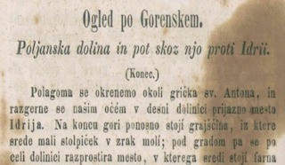
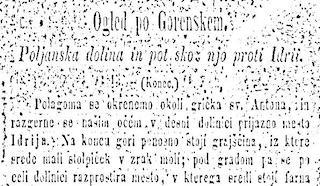
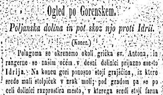
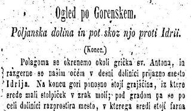
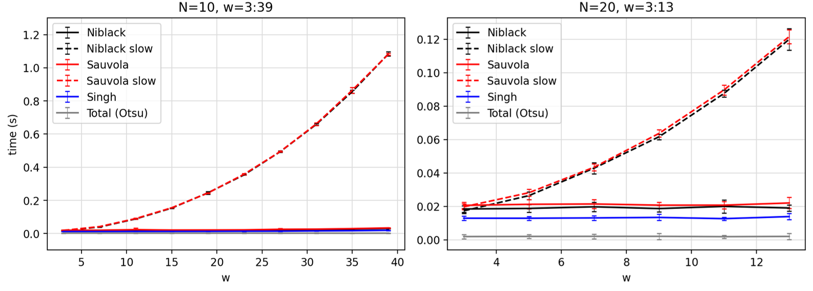
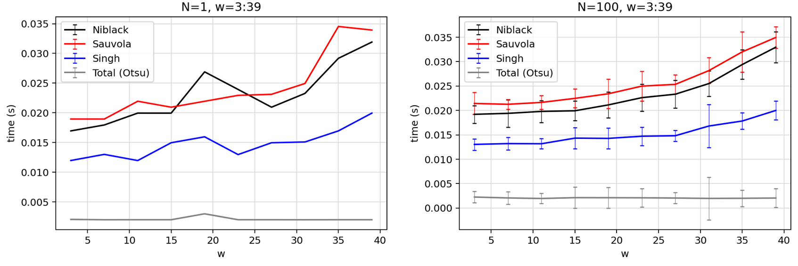
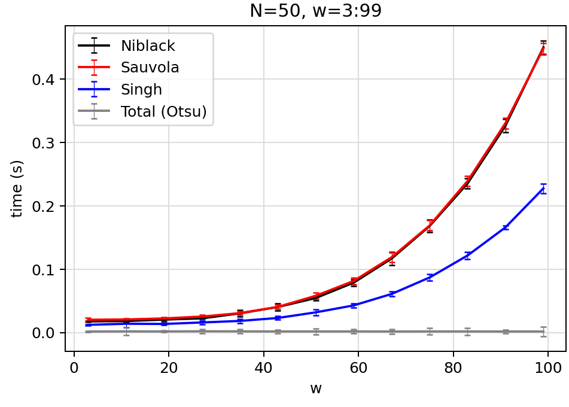
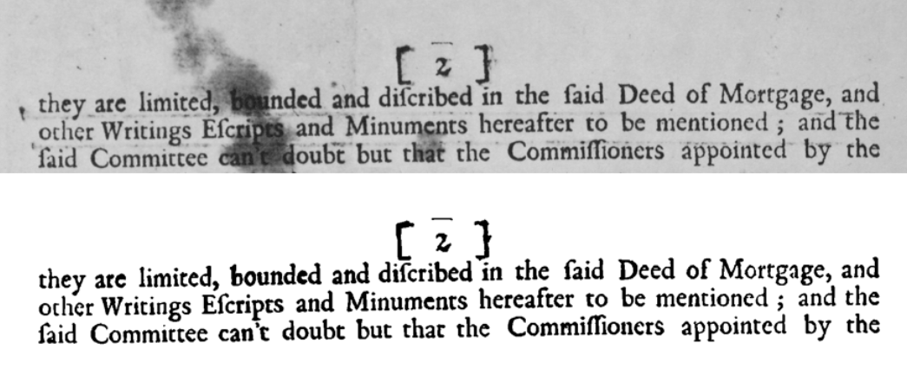

---

# 0.Purpose

This project consists in comparing different algorithms for image
binarization in order to find out which one is better for recovering
degraded texts documents. The algorithms that are taken into consideration are the                                                                                once described in the following paper [Singh et
al., ''A New Local Adaptive Thresholding Technique in Binarization'',
,International Journal of Computer Science Issues,
2011.](https://www.researchgate.net/publication/220485031_A_New_Local_Adaptive_Thresholding_Technique_in_Binarization) 
In particular the attention is focused on local thresholding techniques.
To test the algorithms it is considered not only their calculus speed, but
also their accuracy in terms of number of pixels well converted after
the application of the thresholding.

# HOW TO USE: 

***SKIMAGE MOD for BINARIZATION ALGORITHMS COMPARISON***

This mod will add to your skimage library the definition of a new local adaptive
thresholding algorithm (Singh et al. [1]). 
###### In order to use these scripts you will have to modify your skimage library: ######
------> substitute the files in C:/user/.../skimage/filter
	with those (homonyms) contained in "package mods".

################################## WHAT'S NEW 

The new functions that have been added in the thresholding.py are the following :
1) _only_mean 

\`\`\`

    def _only_mean(image, w):

      """Return local mean of each pixel using a
      neighborhood defined by a rectangular window size ``w``.
      The algorithm uses integral images to speedup computation.

      Parameters
      ----------
      image : ndarray
          Input image.
        w : int, or iterable of int
        Window size specified as a single odd integer (3, 5, 7, …),
        or an iterable of length ``image.ndim`` containing only odd
        integers (e.g. ``(1, 5, 5)``).

       Returns
       -------
       m : ndarray of float, same shape as ``image``
        Local mean of the image.
         """

    if not isinstance(w, thresholding.Iterable):
        w = (w,) * image.ndim
    _validate_window_size(w)

    pad_width = tuple((k // 2 + 1, k // 2) for k in w)
    padded = np.pad(image.astype('float'), pad_width,
                    mode='reflect')
    #padded_sq = padded * padded

    integral = integral_image(padded)
    #integral_sq = integral_image(padded_sq)

    kern = np.zeros(tuple(k + 1 for k in w))
    for indices in titertools.product(*([[0, -1]] * image.ndim)):
        kern[indices] = (-1) ** (image.ndim % 2 != np.sum(indices) % 2)

    total_window_size = np.prod(w)
    sum_full = ndi.correlate(integral, kern, mode='constant')
    m = crop(sum_full, pad_width) / total_window_size
    #sum_sq_full = ndi.correlate(integral_sq, kern, mode='constant')
    #g2 = crop(sum_sq_full, pad_width) / total_window_size
    # Note: we use np.clip because g2 is not guaranteed to be greater than
    # m*m when floating point error is considered
    #s = np.sqrt(np.clip(g2 - m * m, 0, None))
    return m#, s

2) 
\`\`\`

    def threshold_singh(image, window_size=15, k=0.2, r=None):
       """Applies Singh local threshold to an array.

       The threshold T is calculated for every pixel in the image using
       the following formula:

           T = m(x,y) * (1 + k * ((d(x,y) / 1 - d(x,y)) - 1))

       where m(x,y) and d(x,y) are the local mean and the local deviation of
       pixel (x,y) neighborhood defined by a rectangular window with size wxw
       centered around the pixel. k is a configurable parameter
       that weights the effect of standard deviation.
   
       Parameters
       ----------
       image : ndarray
           Input image.
        window_size : int, or iterable of int, optional
        Window size specified as a single odd integer (3, 5, 7, …),
        or an iterable of length ``image.ndim`` containing only odd
        integers (e.g. ``(1, 5, 5)``).
        k : float, optional
        Value of the positive parameter k.

    Returns
    -------
    threshold : (N, M) ndarray
        Threshold mask. All pixels with an intensity higher than
        this value are assumed to be foreground.

    Notes
    -----
    This algorithm is originally designed for text recognition.

    References
    ----------
    [1] T Romen Singh, Sudipta Roy, O Imocha Singh, Tejmani Sinam, Kh Manglem Singh.
        "A New Local Adaptive Thresholding Technique in Binarization." IJCSI
        International Journal of Computer Science Issues. 2011; 8(6-2): 271-276.

    Examples
    --------
    >>> from skimage import data
    >>> image = data.page()
    >>> t_singh = threshold_singh(image, window_size=15, k=0.2)
    >>> binary_image = image > t_singh
    """
    
    m = _only_mean(image, window_size)
    d = image - m
    
    return m * (1 + k * ((d / 1-d) - 1))

# Project Structure

- binarization_algorithms.py  
    -script to process images with different algorithms.
    
      
In the test directory are present the following:  

 - timing_comparison.py
      in which are evalueted the algorithms speed's.

 - binarization_performances.py** 
      in which are calculated the 3 performance metrics (A/F-score/PSNR).

The _only_mean function has been tested on a uniform image and as it is expected return as a output the same input image.

DIBCO 2009 --> directory in which you find test images with the corresponding GT.
images --> directory with images output.

# 1.Theoretical Aspects

## 1.1 Thresholding

Thresholding is a useful technique normally adopted in image processing
to separate foreground (in our case the written words) from the
background (the sheet).
Thresholding methods are divided into two
categories:

-   **Global methods** - They try to find a single threshold
    value for the whole document: each pixel is assigned to page
    foreground or background based on its gray value. Global methods are
    very fast and they give good results for typical scanned documents.
    The downside is that they are inappropriate for degraded documents.
    If the illumination over the document is not uniform (like in
    camera-captured documents), global methods tend to produce marginal
    noise along the page borders.

-   **Local methods** - These techniques estimate a different
    threshold for each pixel according to the grayscale information of
    the neighbouring pixels. Unfortunately, this kind of approach risk
    to be heavier in computational terms. That's why, following the results
    of Singh et al.'s paper, the algorithms we implemented are using
    the Integral Sum Image, a particular technique that allows to speed
    up calculus time.

They are now briefly illustrate the three Local Thresholding methods that are used and the definition of the Integral Sum Image.

## Niblack's Technique

In this method the local threshold value ) at)(pixel
coordinates) is calculated within a window of size  as:
,

where ,  are the local mean and standard deviation of the pixels inside the local window and is a bias. The result is satisfactory at and . The local  
mean  and standard deviation  adapt the value of the threshold according to the contrast in the local neighborhood of the
pixel. The bias  controls the level of adaptation varying the threshold value.

## Sauvola's Technique

In Sauvola's method, the threshold  is calculated using the mean  and standard deviation  of the pixels within a window of size  as:
 ,
 where  is the maximum value of the standard deviation ( for a grayscale document), and  is a bias, which takes positive values in the range . Experiments with different values of  show that  gives the best results.

## Singh's Technique

This technique is the one proposed in the article (Singh, 2011). It is a
locally adaptive thresholding technique that removes background by using
local mean and mean deviation. Indeed, the principal difference of this
method from the previous ones is that standard deviation 
is not required. On the other hand, the threshold is calculated through
the local mean  and mean deviation as:
, 
where  is the local mean
deviation and  is a bias. Its range is  
Calculation of  is straightforward by subtracting the mean  the concerned pixel. Because of that, Singh's technique can binaries faster than other local techniques and it's also found to be better in terms of quality. The proofs of these statements are displayed in the next sections.

## Integral Sum Image

[Singh et
al., ''A New Local Adaptive Thresholding Technique in Binarization'',
,International Journal of Computer Science Issues,
2011.](https://www.researchgate.net/publication/220485031_A_New_Local_Adaptive_Thresholding_Technique_in_Binarization)
presents a fast approach to compute local thresholds,
without compromising the performance of local thresholding techniques
using the integral sum image as prior process. 
An integral sum image  of an input image  is defined as "the image in which the intensity at a pixel position is equal to the sum of the intensity of all pixels above and to the left of that position in the original image" (T. Romen Singh, Sudipta Roy et. al. International Journal of Computer Science Issues, 2011).
Using the integral sum image for finding local mean of the neighbouring pixels in a certain window, the computational time
speeds up and achieves binarization speed close to the global methods, as displayed in the result section (4). Furthermore, using this approach, the
computation of  not depend on local window size.
Because of these important advantages of using  the algorithms are implemented  for all the local thresholding techniques using the integralsum image (fast versions). We also implemented Niblack's and Sauvola's techniques without (slow versions) for comparison.

      

# Binarization algorithms

For implement the techniques illustrated previously, the  library has been used. Some modifications in the  are required in order to add the Singh's techniques.
In the README.txt are present the steps in order to run correctly the python scripts. 

# 3. Example of application on text images

## Results

Here is reported an example of application of the different algorithms on one test image. 

   

       

 

Figure 1. Top:  original test image; Niblack w=15, k=-0.045
          Sauvola w=15, k=-0.06; Singh w=15, k=0.06

# 4.Computational time comparison 

## Implementation

A system for measuring the processing time (PT) of a test image with 6 different methods is implemented: the
Niblack's (in both fast and slow versions), Sauvola's (fast and slow versions), Singh's and the Otsu global algorithm.
In particular, it is measured the PTs of the adaptive local algorithms, varying the input variable (size of the "neightbour").

They are showed some plots of the results that are obtained using a 600x350px test image.
Especially for the comparison between fast algorithms, it was important to provide many repeated measurements of the PTs and average them, in order to smooth the stochastic fluctuations that affect these values.

## Results

From fig.[2] it is evident that for the slow algorithms, which do not use integral sum, PT shows a strong (at least quadratic) dependence on  while the fast versions, the Singh and the global algorithms PTs are approximately constant and of the same order of magnitude 

{Figure[2]: PTs (y-axis) vs size of the window w (x-axis) for a 600x350px test
image. Each point is the result of the average computed over 10
different measurements. The dashed lines represent the PTs of the slow
versions of Niblack and Sauvola algorithms. The continous lines
represent the fast Niblack and Sauvola, the Singh and the Otsu
algorithms.
In the bottom image a smaller range of w is shown, so that fast
algorithms are well
distinguishable}

In fig.[3]  it can be appreciated the fast
algorithms behaviour: As expected the global
thresholding is still the fastest, and the second fastest is the Singh's.
(It is also expected this, since it does not need to compute
the standard deviation in order to calculate the thresholding value for
each neighbour).
In this plot it is also visible a slow growth of PT with respect to w
for the fast local algorithms. This trend is actually very weak and it
wasn't expected theoretically but it is probably due to some
aspects of the practical implementation of the algorithms:

-   The padding of the image, that is always necessary before the
    processing with local algorithms, expands the image. In particular,
    the margin size depends directly on w.

-   The particular mechanism used to access elements of the integral
    image when computing thresholding values is not completely
    independent on w (even if it remains true that the number of
    *arithmetic operations* required does not depend at all on w).

{Figure[3]: Focus on fast algorithms: on the left are shown the results of a
single measurements of the PTs (strong fluctuations), on the right are
plotted the average trends over 100 runs of the algorithms.
For all the local adaptive algorithms a weak positive trend was
observed.}

Pushing w towards very large values (50" title=">50" /> it is observed
a progressive growth of this trend, which becomes progressively more
important, as shown in
fig.[4] However, in absolute terms it
remains very small (negligible) compared to slow algorithms' measured
PTs; In the table below are shown measured PTs for a very big window
size (w=91):

{Figure[4]:Fast algorithms PTs measured over a large range of w (50-runs average
results).}

.png){Figure[5]:time_table}

## 5. Binarization quality evaluation with GT images

### The DIBCO 2009 dataset

In order to test in a more quantitative way the quality of the
binarization obtained with the different algorithms, 
the DIBCO2009 dataset (from the first edition of the Digital Image
Binarization COntest, organized in the context of IDCAR - International
Conference on Document Analysis and Recognition, in 2009) has been choosed. 
The dataset  and
contains a series of digital images and for each of them the relative
"ground truth" (GT) binarized image. The images are essentially photos
of handwritten or machine-printed degraded documents, for which
binarization is clearly a non-trivial task. 
The images we used were originally color *.bmp* images, with a
resolution <1MP. 

{Figure 6: An example of a test image from the DIBCO database used for the
binarization quality evaluation (top), and the correspondent GT image
(bottom)

### Evaluation metrics

The system that is used to evaluate the quality of the result of each
algorithm is based on the comparison of the binarized image and the GT
image: each pixel of the two images is compared and the number of
correctly classified and misclassified pixels are counted.
In particular, thay are determined true positives and negatives (Tps/Tns) and false positives and negatives (Fps/Fns), and with these to calculate accuracy (A) and the F-score (F):

Where:  (precision) 
(sensitivity)
   
    
Accuracy then corresponds to the percentage of pixels which are correctly classified.

F-score is a value that takes into account both precision (ink pixels detected, over the total number of pixels classified as ink) and sensitivity (ink pixels detected, over the total number of ink pixels) and depends on a parameter . 
If  then F corresponds to an harmonic mean between the two values (and in this case is usually called F1-score). A value  increases the weight of precision (Fns matter less), while a value &space;1" title="\beta > 1" /> increases the weight of sensitivity (Fns matter more).\
In addition to accuracy (A) and F-score it is considered also a Peak Signal-to-Noise Ratio (PSRN), which can be calculated as:

These three parameters are choosen to demonstrate that this could a be a valid approach. Accuracy and PSNR must be seen as general indicators of the similarity between binarized image and the GT image. F-score can be a little bit more \"specific\", since we can adjust parameter in order to give more importance to ink pixel classification (for a better readability).

### Results

The obtained results obviously depend on the input parameters of the
algorithms (window size  and parameter . ) The simplest way to find the
best input parameters set (for each different algorithm) is to iterate
the binarization processing for a certain range of  and  to calculate
the 3 performance metrics (A/F-score/PSNR) for each obtained image and
then to graphically individuate the maxima points. Note that this
\"naif\" maximization method is possible since the parameters are only
two and test images are pretty small (PTs are  then iteration of the processes doesn't take too long).
Fig.[7] shows the resulting values of accuracy, F-score and PSNR for the test
image reported in fig.[6]. F-score was calculated with a  so as to give more importance to sensitivity instead of precision (it is important that every pixel of ink is detected in order
to make the binarized image clearly readable).

 
{#Figure 7:Accuracy, PSNR and F-score ( surface plots for the three
algorithms. Maxima points can be easily graphically determined.  }

{Figure 8: from top: Singh,Sauvola,Niblack) with
the best set of input variables (PSNR
maximized).

# Conclusions

In conclusion, the outputs of local thresholding techniques have been compared on different images. Considering degraded text documents (for example due to humidity infiltration) and camera-captured photos affected by illumination's problems, Singh's technique has given better results on a qualitative point of view. On the other hand, also Sauvola's technique has provided good outputs even if they show an overall \"grey background\" due to misclassified background pixels.
Furthermore, it has been illustrated that with a careful choice of window dimension  and bias  even Niblack's technique has provided
good outputs where text characters are legible even if the binarization has not performed well along borders of images.
A more quantitative research of performance of the algorithms has been conducted with an image from the DIBCO 2009 dataset and its relative ground truth. It has been verified that Singh and Sauvola offer very similar results, generally better than Niblack ones. However obviously the measures (A, F2-score and PSNR), used for the evaluation purpose, vary according with the window dimension and  the selection of these parameters depends on the considered image.
The estimate of computation processing time has shown that local thresholding techniques implemented with the integral sum image are
faster than their slow versions: around  versus  (for the employed image of size  px). In addition, the computational time of the fast versions does not show any dependence on  with ranges up to approximately 30 pixels, as theoretically expected.
Of course, all the final results could be improved by a tailored pre-processing step before the thresholding.

# References

*A New Local Adaptive Thresholding Technique in Binarization*, IJCSI
International Journal of Computer Science Issues, Vol. 8, Issue 6, No 2,
November 2011.

*An Efficient Phase-Based Binarization Method for Degraded Historical
Documents*, Alaa Sulaiman et. al., Journal of Imaging, 2019 .

DIBCO 2009 - Document Image Binarization COntest. \"Benchmarking
DataSet\". Web.
<https://users.iit.demokritos.gr/~bgat/DIBCO2009/resources.html>

https://scikit-image.org

:::
